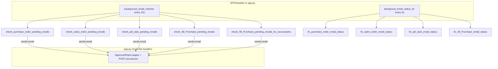

# Transpek Mail Automation — Project Flow

Comprehensive explanation of the four modules: when emails are triggered, how approval/rejection updates columns, and what the fix functions do.

---

## Architecture Overview



**Core idea:** A background job looks for rows where BC “document is ready” + “email not yet sent” (`Email Send` = 0). After a successful send, `Email Send` → 1 (and `Emaill Status` is updated). Approval/rejection changes `Status` / `Emaill Status` so the row no longer matches the trigger query. **Fix functions** reset `Email Send` when BC rolls the document back to “open” while the app still thinks mail was sent.

---

## Shared Column Pattern

| Column | Role |
|--------|------|
| **`Email Send`** | `0` / `NULL` / `''` = eligible to send; `1` = already sent (blocks re-send in most checks) |
| **`Emaill Status`** | Text workflow state (`pending`, `sent for approval`, `Approved`, etc.) — gates approval pages and some IM flows |
| **`Status`** (or module-specific) | BC document lifecycle (0 = open, 2 = pending approval, 1 = approved, etc.) |
| **`Timestamps`** | Set when email is sent or action is taken |
| **`Reason`**, **`User Data`** | Filled on approve/reject from the web form |

> **Note:** Column name is **`Emaill Status`** (double “l”) in the database.

---

## Module 1 — IM Purchase Requisition

**Table:** `PURCHASE_REQ_TABLE` (single table for everything)

**Routes in `app.py`:**
- `/email-approve`, `/email-reject` → HOD
- `/email-accountant-approve`, `/email-accountant-reject` → Accountants
- `/email-process-approval`, `/email-process-accountant-approval` → POST handlers

This module has a **two-step** approval chain: **Accountants → HOD**.

### A) Email to Accountants (First Step)

**Function:** `check_IM_Purchase_pending_emails_for_accountants()`  
**Runs:** every 15s via `background_email_checker`

| Column | Required value |
|--------|----------------|
| `Status` | `2` |
| `Emaill Status` | `''`, `NULL`, `'pending'`, or `'Pending'` |

**After successful send:**

| Column | New value |
|--------|-----------|
| `Emaill Status` | `'pending by accountants'` |
| `Timestamps` | current time |
| `Email Send` | **not changed** (stays 0) |

**Approval page shown when:** `Status = 2` and `Emaill Status = 'pending by accountants'`

### B) Accountant Approve / Reject

**POST:** `/email-process-accountant-approval`

| Action | Column updates |
|--------|----------------|
| **Approve** | `Emaill Status` = `'approved by acc'`, `Approved By Account Dept_` = `1`, `Reason`, `User Data`, `Timestamps` |
| **Reject** | `Emaill Status` = `'pending'`, `Status` = `0`, `Approved By Account Dept_` = `0`, `Reason`, `User Data`, `Timestamps` |

Already-processed guard: `Emaill Status` in `'approved by acc'`, `'rejected by acc'`.

### C) Email to HOD (Second Step)

**Function:** `check_IM_Purchase_pending_emails()`

| Column | Required value |
|--------|----------------|
| `Status` | `2` |
| `Email Send` | `'0'`, `NULL`, or `''` |
| `Emaill Status` | `'approved by acc'` |

**After successful send:**

| Column | New value |
|--------|-----------|
| `Email Send` | `1` |
| `Emaill Status` | `'sent to hod for approval'` |
| `Timestamps` | current time |

**Approval page shown when:** `Status = 2` and `Emaill Status = 'sent to hod for approval'`

### D) HOD Approve / Reject

**POST:** `/email-process-approval` → `update_purchase_request_status_with_text()`

| Action | `Status` | `Emaill Status` | Other |
|--------|----------|-----------------|-------|
| **Approve** | `1` | `'Approved'` | `Approved By`, `Approved Date/Time`, line items: `[Approved for Process]=1`, `[Line Status]=1` |
| **Reject** | `0` | `'Pending'` | `Reason`, `User Data`; `Approved By Account Dept_` → `0` if mapped |

HOD reject uses `int_status=0`, which maps to **`Emaill Status = 'Pending'`** (not `'Rejected'`), so the record can re-enter the accountant flow after fix/reset.

### E) Fix Function — `fix_IM_Purchase_email_status()` (every 5s)

**Finds rows where:**

| Column | Value |
|--------|-------|
| `Status` | `0` |
| AND any of | `Email Send = '1'`, `Emaill Status = 'pending by accountants'`, `Approved By Account Dept_ = 1` |

**Resets to:**

| Column | Value |
|--------|-------|
| `Email Send` | `'0'` |
| `Approved By Account Dept_` | `0` |
| `Emaill Status` | `'pending'` |

**Why:** BC set the document back to open (`Status=0`), but email flags still say “in progress”. Reset allows the accountant email to fire again when `Status` returns to `2`.

---

## Module 2 — Purchase Order

**Tables:**
- `PURCHASE_EMAIL_TABLE` — email flags (`Email Send`, `Emaill Status`, approver/creator emails)
- `PURCHASE_HEADER_MAIN` — `Status` (joined on `[No_]`)

**Routes:** `/purchase-email-approve`, `/purchase-email-reject`, `/purchase-email-process-approval-and-reject`

### Email Trigger — `check_purchase_order_pending_emails()`

| Table | Column | Value |
|-------|--------|-------|
| `PURCHASE_HEADER_MAIN` | `Status` | `2` |
| `PURCHASE_EMAIL_TABLE` | `Email Send` | `'0'`, `NULL`, or `''` |

**After successful send (email table only):**

| Column | Value |
|--------|-------|
| `Email Send` | `1` |
| `Emaill Status` | `'sent for approval'` |
| `Timestamps` | current time |

### Approval Page Shown When

| Column | Value |
|--------|-------|
| Header `Status` | `2` |
| `Emaill Status` | `'pending'`, `'sent for approval'`, or `'reminder sent'` |

### Approve / Reject — POST Handler

| Action | `PURCHASE_EMAIL_TABLE` | `PURCHASE_HEADER_MAIN` | Other |
|--------|------------------------|------------------------|-------|
| **Approve** | `Emaill Status` = `'Approved'`, `Reason`, `Timestamps`, `User Data` | `Status` = `1` | `APPROVAL_ENTRY_TABLE.Status` = `4`, delete restriction records, schedule `delayed_po_api_call` (PO release API) |
| **Reject** | `Emaill Status` = `'Rejected'`, … | `Status` = `0` | `APPROVAL_ENTRY_TABLE.Status` = `3` |

**No re-email:** After action, header `Status` is no longer `2`, so the trigger query does not match—even if `Email Send` stays `1`.

### Fix — `fix_purchase_order_email_status()`

| Condition | Fix |
|-----------|-----|
| Header `Status = 0` AND email `Email Send = '1'` | Set `Email Send = '0'` on email table |

**Why:** Document reopened in BC; reset mail flag so when `Status` goes back to `2`, approval email can send again.

---

## Module 3 — Sales Order

**Tables:** `SALES_ORDER_EMAIL_TABLE` + `SALES_ORDER_MAIN` (same pattern as PO)

**Routes:** `/sales-email-approve`, `/sales-email-reject`, `/sales-order-email-process-approve-reject`

### Email Trigger — `check_sales_order_pending_emails()`

Same logic as PO:

| Header `Status` | `2` |
| Email `Email Send` | `'0'`, `NULL`, `''` |

**After send:** `Email Send = 1`, `Emaill Status = 'sent for approval'`, `Timestamps` updated.

### Approval Page

Header `Status = 2` and `Emaill Status` in `pending` / `sent for approval` / `reminder sent`.

### Approve / Reject

| Action | Email table | Header table |
|--------|-------------|--------------|
| **Approve** | `Emaill Status = 'Approved'` | `Status = 1` |
| **Reject** | `Emaill Status = 'Rejected'` | `Status = 0` |

Also updates `APPROVAL_ENTRY_TABLE`, restriction records on approve, and schedules `delayed_so_api_call` on approve.

### Fix — `fix_sales_order_email_status()`

Same as PO: `SALES_ORDER_MAIN.Status = 0` + `SALES_ORDER_EMAIL_TABLE.Email Send = '1'` → reset `Email Send` to `'0'`.

---

## Module 4 — Job Card

**Table:** `JOB_CARD_MAIN_TABLE` (email + approval fields on same row; `JOB_CARD_SECONDARY_TABLE` for extra display data)

**Routes:** `/job-card-email-approve`, `/job-card-email-reject`, `/job-card-email-process-approve-reject`

Uses **`TPT_Approval Status`** and **`Approved`** instead of a single header `Status` on a second table.

### Email Trigger — `check_job_task_pending_emails()`

| Column | Value |
|--------|-------|
| `TPT_Approval Status` | `1` |
| `Approved` | `0` |
| `Email Send` | `'0'`, `NULL`, or `''` |

**After send (note: DB updated before email is sent):**

| Column | Value |
|--------|-------|
| `Email Send` | `1` |
| `Emaill Status` | `'sent for approval'` |
| `Timestamps` | current time |

### Approval Page Shown When

| Column | Value |
|--------|-------|
| `TPT_Approval Status` | `1` |
| `Approved` | `0` |
| `Emaill Status` | `pending` / `sent for approval` / `reminder sent` |

“Still in process” when `TPT_Approval Status = 0` and `Approved = 0`.

### Approve / Reject

| Action | `Emaill Status` | `TPT_Approval Status` | `Approved` |
|--------|-----------------|----------------------|------------|
| **Approve** | `'Approved'` | `2` | `1` |
| **Reject** | `'Rejected'` | `0` | `0` |

Plus `Reason`, `User Data`, `Timestamps`, `APPROVAL_ENTRY_TABLE`, restriction cleanup on approve.

### Fix — `fix_job_task_email_status()`

| Condition | Fix |
|-----------|-----|
| `TPT_Approval Status = 0`, `Approved = 0`, `Email Send = '1'` | `Email Send = '0'` |

---

## How “No Further Emails” Is Enforced

| Mechanism | Modules |
|-----------|---------|
| **`Email Send = 1`** | PO, SO, Job Card, IM (HOD path) — row no longer matches “not sent” query |
| **`Emaill Status` state** | IM accountant/HOD — e.g. after HOD mail: `'sent to hod for approval'`; after decision: `'Approved'` / `'Rejected'` / `'approved by acc'` |
| **Header / approval status change** | PO/SO: header `Status` leaves `2`; Job: `TPT_Approval Status` leaves `1` or `Approved` becomes `1` |
| **Fix only runs on “open” documents** | Resets flags when BC rolls back to open so the **next** submission can email again—not while still pending |

---

## Status Value Cheat Sheet

### PO / SO Header `Status`

| Value | Meaning in app |
|-------|----------------|
| `0` | Open / rejected / not ready for approval email |
| `2` | Pending approval — **email trigger active** |
| `1` | Approved (after web approval) |

### IM `Status`

| Value | Meaning |
|-------|---------|
| `0` | Open / rejected / sent back |
| `2` | In approval workflow |
| `1` | HOD approved |
| `3` | Treated as “already processed” on approval pages |

### Job Card

| Column | Trigger | After approve | After reject |
|--------|---------|---------------|--------------|
| `TPT_Approval Status` | `1` | `2` | `0` |
| `Approved` | `0` | `1` | `0` |

---

## End-to-End Flow (Typical PO / SO / Job)

```
BC sets document ready (Status=2 or TPT=1)
        ↓
Background checker finds Email Send = 0
        ↓
Sends approval email → Email Send=1, Emaill Status='sent for approval'
        ↓
Approver opens link (encrypted request_id in URL)
        ↓
Approve/Reject POST → Emaill Status + Status updated
        ↓
Row no longer matches trigger → no more approval emails
        ↓
(If BC reopens doc) Fix sets Email Send=0 → cycle can repeat
```

**IM Purchase** adds the accountant loop before the HOD step:

```
Status=2, Emaill Status pending → mail to accountants
        ↓
pending by accountants → accountant approve → approved by acc
        ↓
Email Send=0 + approved by acc → mail to HOD
        ↓
sent to hod for approval → HOD approve/reject
```

---

## Tables Used (from `constants.py`)

| Module | Primary table(s) |
|--------|------------------|
| IM Purchase | `PURCHASE_REQ_TABLE` |
| Purchase Order | `PURCHASE_EMAIL_TABLE` + `PURCHASE_HEADER_MAIN` |
| Sales Order | `SALES_ORDER_EMAIL_TABLE` + `SALES_ORDER_MAIN` |
| Job Card | `JOB_CARD_MAIN_TABLE` (+ `JOB_CARD_SECONDARY_TABLE` for data) |

---

## Key Source Files

| Purpose | File |
|---------|------|
| Flask routes & approval POST handlers | `app.py` |
| Background scheduler wiring | `app.py` (`start_scheduler`), `Utility_Functions/config/db_utils.py` |
| IM Purchase email & status logic | `Utility_Functions/IM_Purchase/im_purchase.py` |
| Purchase Order logic | `Utility_Functions/Purchase_Order/purchase.py` |
| Sales Order logic | `Utility_Functions/Sales_Order/sales_order.py` |
| Job Card logic | `Utility_Functions/JOB_Task/job_task.py` |
| Table name constants | `Utility_Functions/config/constants.py` |
| PO/SO release API after approve | `Utility_Functions/config/release_API.py` |
| One-time column reset utility | `Utility_Functions/config/email_send_reset.py` |

---

## Scheduler Timing

| Job | Interval | Function |
|-----|----------|----------|
| Email checker | 15 seconds | `background_email_checker()` |
| Status fix | 5 seconds | `backgroud_email_status_fix()` |

Started from `app.py` on import via `start_scheduler()`.
